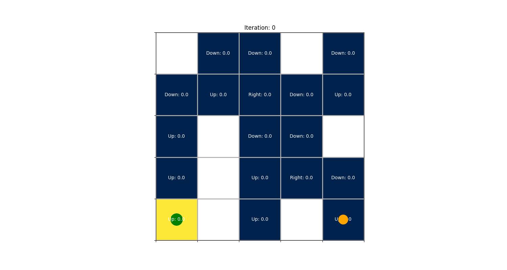

# MORPHIN – Continual & Adaptive Reinforcement‑Learning Agents  
Repository for the paper **“Adapting the Behaviour of RL Agents to Changing Action Spaces and Reward Functions”**.

  

---

## 1. Overview
MORPHIN is a modular framework built around tabular Q‑Learning that can

* **Detect concept drift** (changes in goals or reward functions) and adapt on‑the‑fly.  
* **Insert or retire actions dynamically** without re‑training from scratch.  
* **Preserve prior knowledge** to minimise catastrophic forgetting.  
* **Scale beyond toy tasks**, demonstrated both in Grid‑worlds and a traffic‑signal‑control domain.

Our results show faster re‑convergence, reduced sample complexity, and superior cumulative reward compared with naïve re‑starts and fixed‑parameter baselines.  

---

## 2. Repository layout (quick tour)

| Folder | What’s inside | Why it matters |
|--------|---------------|----------------|
| **`memory/`** | Concept‑drift detector + adaptive exploration/learning‑rate scheduling. | Core contribution for environments with **changing reward functions**. |
| **`dynamic_actions/`** | Agent and helpers for **variable‑action spaces** (e.g. walls, jump actions). | Demonstrates MORPHIN’s ability to add/remove actions at run‑time. |
| **`dynamic_rewards/`** | Continual‑learning notebooks that switch reward shaping during training. | Complements `memory/` experiments with multiple reward regimes. |
| **`simulations/`** | Pre‑rendered GIFs & MP4s―handy for presentations or README badges. | Visual proof of adaptation behaviours. |
| **`traffic_simu_custom/`** | Custom lightweight traffic‑signal simulator (no SUMO) + RL agent. | Shows transfer of MORPHIN ideas to a non‑gridworld domain. |
